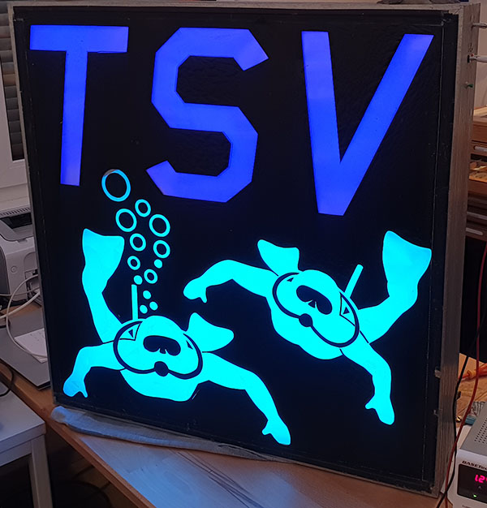
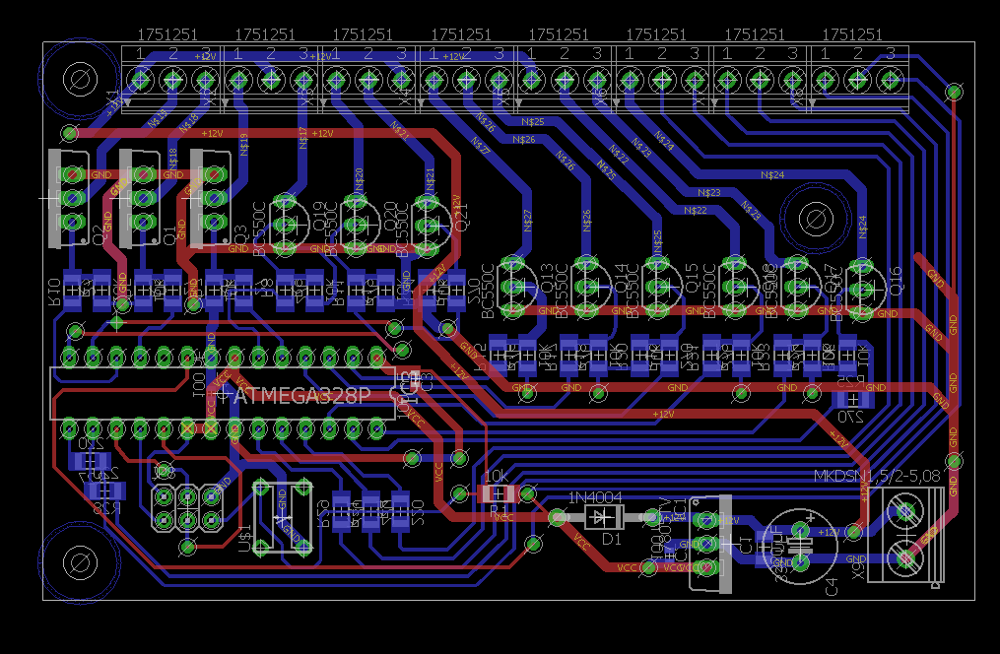
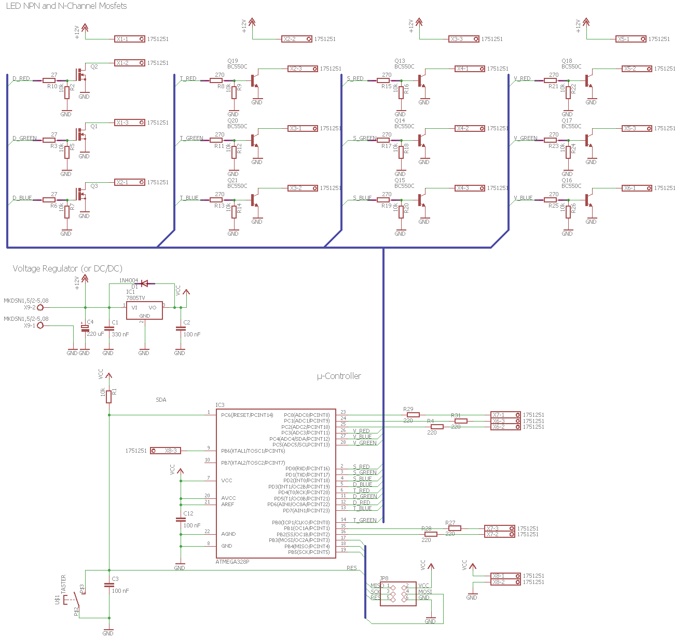

# TSV LED Sign

While cleaning up our workshop in our [TSV Malsch divers club](https://tsv-malsch.de), we found an old sign. It was equiped with E27 bulbs and some stroboscope flashes.
We decided activate it again and update it with RGB LED stripes. 
Since there were still some parts left in my electronic magazine cabinet, i decided to implement an LED controller at a reasonable price.

We extended the sign by a separate RGB LED Stripe array for the diver, and stripes for letters 'T', 'S', 'V'.
The circuit includes a button for selecting mode and some optional, internal status LEDs.

A button triggers an interrupt for an options menu. With this, the user can distinguish between 4 different modes.

The code could be more elegant, but it works. :)

## Modes

To change the mode, push the button on the left to switch through the differen options (visualized by a highlighted letter on the sign). 

First default mode is for the sign placed on the wall in the clubs workshop. Blue text and a slightly changing diver from green to blue and back.
Second and third changes the divers color constantly and also switching the letters color. Difference is the speed: While mode 2 is very slow (eg. for using it when selling things on a festival), mode 3 is fast and can be used on parties. Mode 4 is the disco mode, the whole sign flashes fast.

## Implementation

The controller is an Atmel ATMega 328P. It controls the major RGB light by 3 PWM pins. These 3 pins are connected to N-Channel mosfets (IRLZ 34N in this case). So it's possible to switch up to 68W per Channel. Unfortunatelly, the layout is not optimal, there is no place for heat sinks and the mosfest are close together. Very likely, this maximum is far out. But since the sign is currenly only using less than 4W per channel, this is not a problem..

To save costs, all other channels running a NPN transistor (BC550). This limits the maximum current to 100mA (= 1.2W on 12V).

## Wiring

Numbered from left to right when looking at the circuit from the top, black terminal bottom right. The black terminal is for connecting to 12V. The connector closest to the corner is GND.

Green Terminal (3.5mm)
| Pin | Purpose |
| -------------: | ------------- |
|  1 | +12V out |
|  2 | High current RED channel |
|  3 | High current GREEN channel |
|  4 | High current BLUE channel |
|  5 | +12V out |
|  6 | Low current RED channel 1 |
|  7 | Low current GREEN channel 1 |
|  8 | Low current BLUE channel 1 |
|  9 | +12V out |
| 10 | Low current RED channel 2 |
| 11 | Low current GREEN channel 2 |
| 12 | Low current BLUE channel 2 |
| 13 | +12V out |
| 14 | Low current RED channel 3 |
| 15 | Low current GREEN channel 3 |
| 16 | Low current BLUE channel 3 |
| 17 | Multi purpose output 5V with 220 Ohm resistor, eg. for LED |
| 18 | Multi purpose output 5V with 220 Ohm resistor, eg. for LED |
| 19 | Multi purpose output 5V with 220 Ohm resistor, eg. for LED (used for button in V1.0) |
| 20 | Multi purpose output 5V with 220 Ohm resistor, eg. for LED (not connected in V1.0) |
| 21 | Multi purpose output 5V with 220 Ohm resistor, eg. for LED (not connected in V1.0) |
| 22 | +5V out |
| 23 | GND |
| 24 | Input pin for button. Push-up active, switch against GND to trigger |
 

## Pin out

### Diver LED:
* PD6 red	
* PD5 green
* PD3 blue

### Letter T
* PD4 red
*	PB0 green
*	PD7 blue

### Letter S
* PD0 red
*	PD1 green
*	PD2 blue

### Letter V
* PC3 red
*	PC5 green
*	PC4 blue

Input button: V1.0: PC0 V1.1: PB6  (Since there was a defect on the board 1.0, I used PC0 instead)
Status LED: PC1, PC2 (additional PC0, PB1, PB2 not connected so far)

## Circuit

## Schematics

